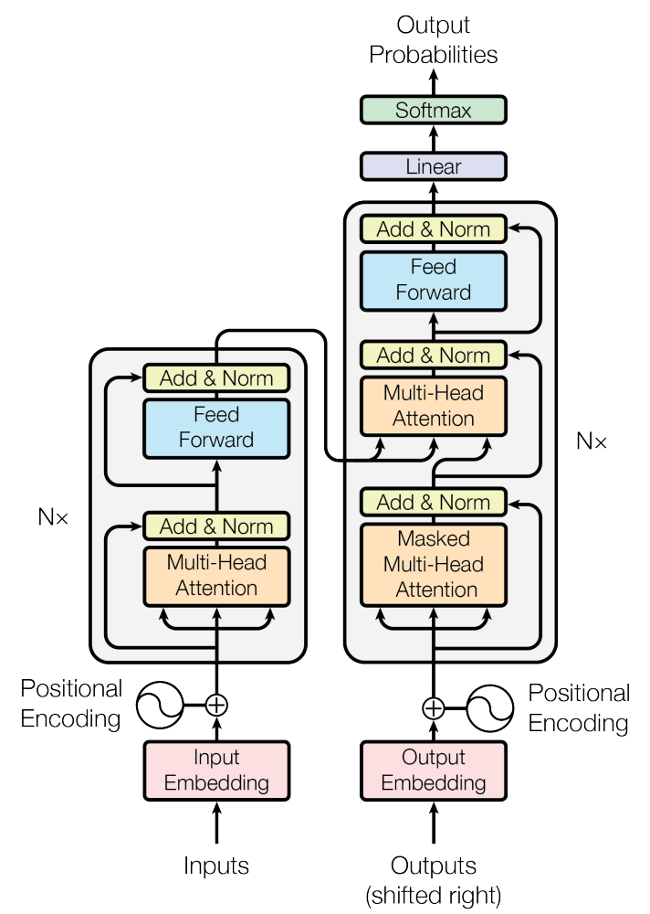
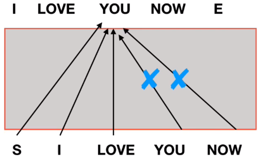
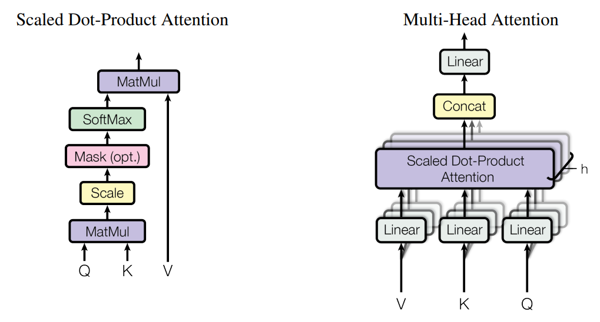
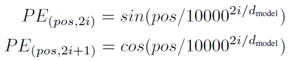
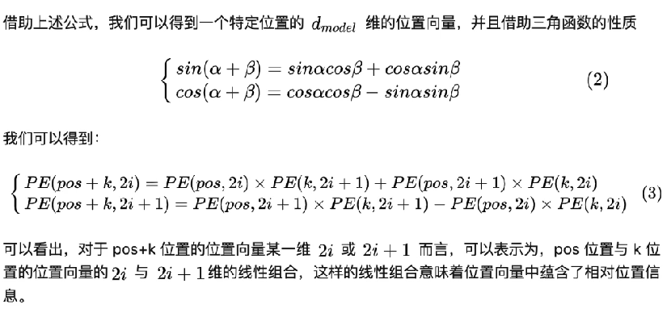
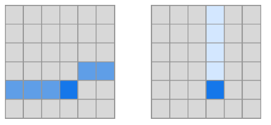
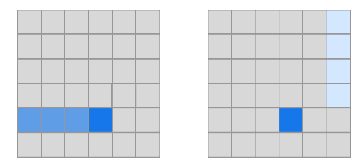

# NLP

---

## [Attention Is All You Need](https://arxiv.org/abs/1706.03762)

### 数据流动
GIF 取自：[https://ai.googleblog.com/2017/08/transformer-novel-neural-network.html](https://ai.googleblog.com/2017/08/transformer-novel-neural-network.html)

### 模型架构

#### 编码器与解码器的连接
输入编码 N 层后，最后一层的输出被喂入所有的层的 decoder（作为 K 和 V） 

#### 解码器的自回归与 mask

- 预测阶段：解码器输入当前已经输出的内容，在最后一个词的位置输出下一个词的 embedding
- 训练阶段：mask 掉后面的所有词（的 attention score）

#### LayerNorm 与 Residual Connection

- 残差连接和 LayerNorm（序列*feature 两个维度一起 norm）：$\text{LayerNorm}(x + \text{Sublayer}(x))$
- 输出维度固定 512

#### 多头注意力机制

- 输入 query 和 key（等长 d，记为 Q，K），attention score 为 $\text{softmax}\frac{\langle Q,K\rangle}{\sqrt{d}}$
- multi-head：首先用可学习的参数把 Q K V 多次线性投影到低维，然后每组独立的做 attention，最终拼接输出。
- 自注意力：K Q V 都是输入本身
- 解码器中，第二个 attention query 为输出

前馈网络：单隐藏层 MLP，ReLU 激活中间层，隐层数量 2048，输出层不激活

#### Positional Embedding
时序信息编码：利用三角函数计算，与 embedding 相加。 

- 任何长度的句子，同一个位置的 positional embedding 相同
- 任何两个位置的 positional embedding 不同（最后一维的波长高达 10000 * 2\pi，一般达不到）
- 相对位置关系可以表示：pos + k 可以用 pos 与 k 来线性表示

#### Linear 层
文中说 embedding 层和 decoder 后的 linear 层共用参数的意思是，最后会把输出的 embedding 与所有词的 embedding 内积，用来算 softmax（听起来效率很低？）

### pytorch 代码实现

#### nn.TransformerEncoderLayer
encoder 的一层，使用 nn.MultiheadAttention 参考 forward 函数中的 else 分支，计算顺序为 MultiheadAttention -> dropout -> residual -> LayerNorm -> fc -> relu -> dropout -> fc -> dropout -> residual -> layernorm

#### nn.TransformerEncoder
做重复多层 **nn.TransformerEncoderLayer **的工作

#### nn.MultiheadAttention
读源代码发现，参数 embed_dim 既是输入维度，又是多个 head 输出维度的和（而非每个 head 的输出维度），也就是说，增加 head 数量并不会增加参数量（实际验证保存的模型大小也验证了这一点

- kdim 和 vdim 指的是输入的维度，API 无法控制中间隐层的维度（事实上降低隐层维度会损失信息）

### [Generating wikipedia by summarizing long sequences](https://arxiv.org/abs/1801.10198)
只留下 transformer 的 decoder，这样利于处理长句子。之后 GPT、BERT 系列基于的就是这样的架构 

Transformer 去掉 encoder，只使用 decoder，更利于长句子
- Transformer：输入序列 -> 输出序列
- Decoder：输入序列与输出序列拼接，中间加 deliminator，整个输入 decoder，做下一词预测

大概 decoder 中，对于 encoder 处理的那个自注意力层也删掉了？
其他细节
- KV 在 attention 前做了卷积，减少 token 数量
- 输入序列切分成多个窗口，每个窗口内做 attention，以实现规模化（计算量相对序列长度线性）

### [Generating long sequences with sparse transformers](https://arxiv.org/abs/1904.10509)
注意力序列长度记为$n$，传统transformer中注意力计算$n^2$的复杂度降低到$n\sqrt[p]{n}$

#### Factorized Self-Attention

- Motivation：可视化传统transformer中的注意力分布，发现注意力的分布式sparse的
- 需要的性质：p次attention操作后，所有token间都有机会关联（避免token被隔离）
- 基本方法：p个attention head，每个head只计算约$\sqrt[p]{n}$个token的注意力。
- 具体做法：文章以p=2举例，给出了两种方案
   - strided：一个head对前$\sqrt{n}$个做attention，一个head每隔$\sqrt{n}$做attention，这样两层attention后，正好所有token都被考虑到，相当于把attention分解成相邻的和远距离的。
      - 这种方法适合图像这种本身就有stride语义的，比如每隔$\sqrt{n}$做attention对应图像的列（下图二），下图右表示，stride=4情况下，每行表示输出（深蓝）经过第一个head连接的（中蓝）和经过第二个head连接的（浅蓝）。

      - 对于NLP这种token没有周期性的，该方法不适合，比如，He, as a professional teacher在stride为2情况下，He想attend到teacher需要先attend到professional，但是He与professional、professional和teacher可能没有联系。换句话说，就是相对位置与token关联性可能无关。
   - fixed：
      - 每隔l个token**连续取c个**“锚点”（绝对位置），第一个head对前一个“锚点”后的所有token做注意力，第二个head对之前的所有“锚点”做注意力。。这样做的语义是c个“锚点”总结前l个token的信息，再通过第二个head向后传播，更符合自然语言的结构。注意下图对应c=1，但是c取1会影响性能，因为无法保证那一个位置的文本适合用于总结前文信息，文章实际取用c=8/16/32，l取128/256。

      - 如果使用多个head，让每个head在l个范围内取不同的c个，比如一个head取121-128，一个head取113-120，会优于都取121-128。

#### 集成到transformer
文章给出了三种方案（原transformer中的multi-head被替换成了这篇文章中介绍的factorizied heads）

- 每个residual block取一种head，比如在第1/3/5/7/...个residual block取第一种head，2/4/6/8/...取第二种head
- 每个residual block保留一个head，不再拆分成p个head，而是直接对所有p类head对应的attention范围取并集做attention（会稍微增加一点计算量）
- 每个residual block保留p种head，把p个head的结果拼接**【这种方案效果最佳】**

为了优化百层级别的transformer：

- 在residual connection前做norm（感觉数学上等价于多在embedding层后norm了一次）
- 考虑到越深的层，输入来自越多层的加和，用$1/\sqrt{2层数}$放缩参数初始化。

关于输入embedding（positional embedding）：

- 考虑到文章提出的factorized attention pattern，使用学习出来的positional embedding会有更好的效果（可以编码pattern信息）
- 编码的定义：
   - 对于图像，文章将H，W，Channel上的坐标分别映射到positional embedding，然后加和
   - 对于文本和声音，文章用两个维度的position，第一个维度表示处于第几组stride（l）内，第二个维度表示处于改组stride内的第几个token。

训练技巧

- 削减训练内存（Gradient Checkpoint）：前向传播时，不存储attention score，只存储每一个residual block的输出，反向传播时重新计算这些attention score。此外，文章不再对attention score做dropout（实现起来困难）。
- Attention Kernel：重新实现了文章定义的attention机制的GPU kernel代码，去除了荣誉的attention mask计算，融合了softmax算子来加速。
- 混合精度训练：计算激活和梯度时使用半精度浮点数

### [On the opportunities and risks of foundation models](https://arxiv.org/abs/2108.07258)
斯坦福出的一篇 survey

## BERT

### [BERT: Pre-training of Deep Bidirectional Transformers for Language Understanding](https://arxiv.org/abs/1810.04805)
 发布于 GPT-1 之后，相比 GPT-1 下一词预测的任务，BERT 使用双向的注意力机制，预测句中的词（完形填空）

**双向注意力机制：**GPT 中每个词只能从之前的词提取注意力，“看不到”后面的词，BERT 则取消了这一限制。或者说，GPT 是只使用 decoder，BERT 是只是用 encoder。 **句子输入构建：**

- 用SEP分割句子（作为每个子句的结尾），用CLS聚合句子信息
- 多了一个表示词属于哪个子句的 segment encoding

 **预训练任务：**

- 【完形填空】随机选取句子中15%的单词来预测。被选择预测的单词不一定被替换成 MASK token（因为下游任务没有这个 token，带来了一些不一致性）：80%替换成MASK token；10%替换成随机token；10%不替换。
- 【NSP，下句预测】从单语语料库中选择很多句子AB，50%的句子B直接出现在A后（正样本），50%的句子B随机选取（负样本）。通过这个任务，CLS聚合了整个句子的信息，用于在下游任务做句子分类。

**模型与优化细节：**

- 24层，特征1024-dim（MLP隐层维度取四倍），16个注意力头，参数量340M。
- 词向量使用WordPiece（30000词汇量）
- 句子分类这种单句任务，第二个句子直接设置为空集。

## GPT

### GPT-1
> [Improving language understanding by generative pre-training](https://www.cs.ubc.ca/~amuham01/LING530/papers/radford2018improving.pdf)

**预训练任务：**next-word-prediction， **微调：**预训练与监督任务的 loss 加权，

**微调任务构建：**修改输入，添加 delim，start，extract，避免修改模型结构，方便知识迁移  **模型与优化细节：**

- 只有 decoder
- 12层，特征768-dim（MLP隐层维度取四倍），12个注意力头
- Adam 优化器
- cosine anneal 学习率方案（范围 0-2.5e-4）
- 每个 batch 64 个句子，每个句子 512 个 token
- 词向量通过 BPE 生成 [https://leimao.github.io/blog/Byte-Pair-Encoding/](https://leimao.github.io/blog/Byte-Pair-Encoding/)
- embedding 层、residual 操作、attention score 均加 0.1 的 dropout
- **positional embedding 是学习出来的**

### GPT-2
> [Language Models are Unsupervised Multitask Learners](Language models are unsupervised multitask learners)

**核心思路：**用“Task Prompt”建模任务信息（而非传统方法给每个任务设计不同的模型架构），从而实现在下游任务不再需要显式监督 **训练数据的收集：**从Reddit论坛上选取至少有三个赞的帖子，爬取里面所有的外部链接。获得的数据集命名为WebText。经过一些数据清洗操作，最后获得了大约40G的文本数据。训练集似乎没有显式构建下游任务的prompt，但是因为训练集很大，会有类似的prompt出现，prompt是在模型评估（预测）时输入的。 **文本到词向量的编码：**

- BPE：把所有符号排列一遍（字母，汉字等），根据语料库中各个单词内符号组合的出现次数，每次 merge 频率最高的两个符号，这样就可以动态的获取到词汇中有意义的字母组合（比如 est er tion）。可以认为是 character-level模型（生僻词表现好）和 word-level模型（常用词表现好）的中间插值。
- unicode处理：如果把每个unicode字符都作为一个BPE的基础字符，光基础字符就有130000之多，而BPE一般merge后也只有32000-64000个字符。因此文章的做法是直接用UTF-8编码，然后每个字节一个token（初始总共256个token），然后避免merge不同character category的字节。最终词汇量为50257。因此GPT-2理论上有能力处理任何文本（不需要任何数据清洗等操作）。此外，embedding参数量似乎不多，按照50000个token，1600-dim估算，大概只有80M。
- 一点小细节：公开数据集可能会把文本做一些预处理，比如Children's Book数据集使用了PTB tokenizer，这些被处理后的token是没有出现在爬取的自然文本的，因此对这些数据集，会先de-tokenize再输入GPT-2，然后再tokenize回去做准确率评估。

**模型结构：**与GPT-1类似，做了如下改动

- 在每个sub-block前而非后做LayerNorm，并且在最后一层的输出前加一个LayerNorm（我的理解是，等价于在输入embedding层也加了LayerNorm）

- 模型参数的初始化考虑了抵消不同深度中残差连接加上的值（放缩为$1/\sqrt{残差连接层数}$倍）
- 48层，特征1600-dim（MLP隐层维度取四倍），12个注意力头，1542M参数

**模型泛化能力：**考虑到WebText爬取范围很大，文章检查了下游测试集与WebText内数据的重合度，验证模型是Genralization而非Memorization。

- 用Bloom filters计算测试集中在训练集中出现的8-grams的比例，发现1-6%的重合度（它们与自己的训练集平均重合度就达到了5.9%）
- 最大的GPT-2模型仍然underfit WebText数据集，这也为更大的GPT-3模型提供了motivation

### GPT-3
> [Language models are few-shot learners](https://proceedings.neurips.cc/paper/2020/hash/1457c0d6bfcb4967418bfb8ac142f64a-Abstract.html)

 在GPT-2的技术基础上，大幅提升模型规模，**并且使用了Few-Shot的方法，**验证了如下几个发现：

- 模型性能随模型规模而提升
- 大模型是一种meta-learner：
   - 图1，3中，随着参数量增大，one-shot/few-shot与zero-shot的差距有所增大
   - 图2中，在context中给出一个训练样本（one-shot）会显著提升模型性能

**下游任务的学习（in-context learning）方式**

- 直接微调模型参数：准确率很高，但是需要大量数据且泛化能力受影响，GPT-3没有采用这种方法。
- Few-Shot Learning：把训练集中的输入输出对用文本模板套写后，作为自然语言prompt输入给模型。
- Zero-Shot：用下游任务的自然语言描述作为prompt。

**模型架构细节：**与GPT-2基本一致，但是注意力机制采取了[Sparse Transformer](https://arxiv.org/abs/1904.10509)的架构（高效计算更长的序列） **局限性：**

- 偶尔重复训练集文献
- 只使用了单向的attenetion（不同于BERT）
- 缺乏人类交互及其他模态的信息（GPT-3.5、InstructGPT等似乎就是解决这一问题）

### [GPT-4 Technical Report](https://arxiv.org/abs/2303.08774)
GPT-3的基础技术+第三方数据集+RLHF **Predictable Scaling：**用一个小模型去预测大模型最终可能达到的loss（用power law，即$L(C)=aC^b+c$去拟合，C为计算量，L为损失函数），这样的预测达到了很高的准确率。这个预测有助于关于alignment（意图对齐）、safety、deployment的权衡取舍，避免了重新训练大模型的庞大费用。
> 这篇报告表示希望这成为一个common的任务： We believe that accurately predicting future capabilities is important for safety. Going forward we plan to refine these methods and register performance predictions across various capabilities before large model training begins, and we hope this becomes a common goal in the field.  

**多模态：**输入文本和图像，生成文本

# CV

---

## 图像识别

### [Swin transformer: Hierarchical vision transformer using shifted windows](http://openaccess.thecvf.com/content/ICCV2021/html/Liu_Swin_Transformer_Hierarchical_Vision_Transformer_Using_Shifted_Windows_ICCV_2021_paper.html)
Swin transformer 视觉领域 transformer 

- ViT：把图像固定的分为 16x16 像素点的 patch，然后全局的做自注意力（复杂度是平方）
- Swin：把图像分为不同层级，每个层级的 patch 大小不同，一组里局部的做注意力，这些多尺寸的特征图很适配各种图像任务的模型架构

 上图是目标检测，下图是语义分割，可以看到都是由不同维度的特征图参与，Swin 不同维度的 attention 提取的特征正好可以使用

#### window shift
 把中窗口位置 shift，来让注意力不会被窗口分割

#### 模型架构

1. patch partition：打成 4x4 的 patch，48=4*4*3 是一个 patch 的像素数量
2. linear embedding：把 patch 维度映射到维度 C（超参数，文章设为 96）
3. patch merging：把相邻 2x2 的 patch 在 C 维度上拼接（如下图把 1234 拼在一起），然后把 4C 维度的向量线性映射到 2C

 Swin Transformer Block 

1. 分小窗口：把 MxM（文章设为 7）的 patch 组成一个窗口（不重叠），自注意力在窗口内计算
2. 移动窗口：让窗口间能通讯（为了计算高效，做了如下 trick）

   - 为了不在移动窗口后增加窗口数量，文章把两级的窗口“cyclic 拼接”
   - 通过掩码使得原图上不相邻的块不进行自注意力
   - 将块移回原始位置

### [Segment Anything](https://arxiv.org/abs/2304.02643)

1. 基于多种prompt来指导语义分割
2. 与模型交互式标注数据，提升标注效率

 模型结构：生成一堆image embedding，然后用基于prompt的decoder去提取相关项目

## 多模态

### CLIP
CLIP，直接用自然语言作为 CV 的类别，无需固定类别范围
具体的训练任务是，给一堆文本，判断哪个文本与图片最匹配（contrasive），而非直接预测文本

## 图像生成（扩散模型）

### 基本原理
[Diffusion Model](diffusion.md)

### Stable Diffusion
> [High-Resolution Image Synthesis With Latent Diffusion Models](https://openaccess.thecvf.com/content/CVPR2022/html/Rombach_High-Resolution_Image_Synthesis_With_Latent_Diffusion_Models_CVPR_2022_paper.html)

Latent Diffusion Model（LDM）：在低维的latent space上运行diffusion model，解耦了压缩（autoencoding）和生成（diffusion），减小计算开销。 **AutoEncoding** $\mathcal{D}(\mathcal{E}(\mathbf{x}))$，$\mathbf{z}=\mathcal{E}(\mathbf{x})$将$H\times W\times c$压缩为$h\times w\times c$

- advasarial训练

   - $L_{rec}$：reconstruction loss
   - $L_{adv}+\log D_\psi(x)$：假样本和真样本各自的adavasarial loss
- 可以加如下两种正则化之一
   - KL-reg：最小化$\mathbf{z}$与高斯分布的KL散度
   - VQ-reg：在decoder中使用一个vector quantization层

**Diffusion Model**  途中$\mathbf{z}_{T-1}\to \mathbf{z}$中间的内容应该表示重复T-1个右边的block

- Pixel space：autoencoder压缩
- latent space：标准的diffusion model（time-conditional UNet，卷积网络）
- conditioning：用domain-specific的编码器$\tau_\theta$编码后，拼接到输入，或者作为KV输入cross attention

**Conditioning例子**

- 文本：transformer编码文本，cross-attention输入LDM
- Semantic synthesis：将语义分割map下采样后与latent representation拼接

- Super resolution：将低清晰度的图像直接与latent representation拼接
- Inpainting：没有具体提，似乎在引文里

### Control Net
> [Adding conditional controltotext-to-imagediffusion models](https://arxiv.org/abs/2302.05543)

给diffusion model加额外的control，比如edge map、segmentation map、keypoints 

- zero convolution：1x1卷积，但是参数初始为0，也就是说会在初始输出0
- 这个结构被应用到一个神经网络的block，我理解是类似stable diffusion中cross attention的作用

**梯度分析：**zero convolution会让对特征输入的梯度归零，但是对参数的梯度不会归零（原网络的存在导致参数的梯度并非完全由特征的梯度向前传导，因此不会让训练stuck） **完整架构：**  【其他一些具体的参数训练细节没有看】
